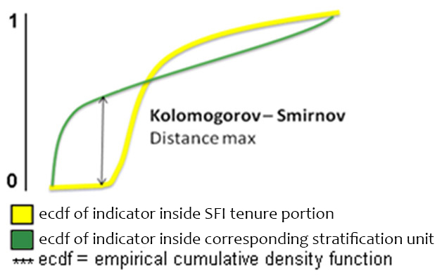
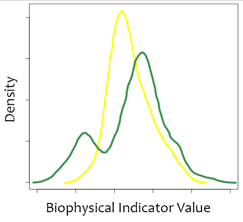
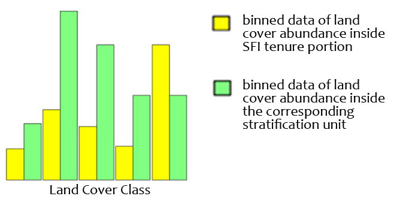
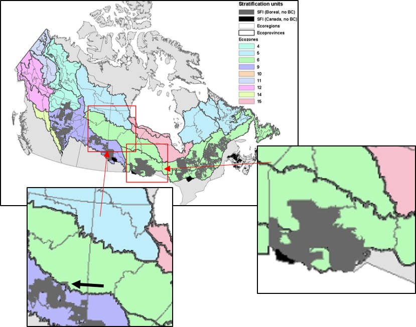
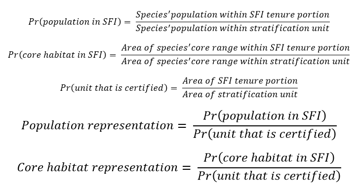

# Representation Analysis

Prior to the analysis, we converted all datasets (i.e., SFI boundaries, stratification units, and biophysical and species indicators) to a common projection, spatial extent, and resolution (1 km2). We then intersected the SFI boundary raster with each ecological unit, resulting in 43 "stratification units" for subsequent analyses (6 ecozones, 12 ecoprovinces, and 25 ecoregions) with some SFI tenures within them. For each of these 43 units, we calculated the representation of the SFI tenure portion using the selected biophysical and species indicators. Following approaches developed and employed by BEACONs, we compared the distribution or proportion of each indicator within the SFI tenure to its distribution in the corresponding stratification unit.

Continuous biophysical indicators (CMI, GPP, LED). We evaluated representation using the Kolmogorov-Smirnov (KS) statistic (Figure 2). The KS statistic compares the distribution of the biophysical indicator within the SFI tenure portion to the distribution of that same indicator within the stratification unit in which the SFI tenure is contained. It measures how similar the SFI tenure is to the ecological unit within which it is embedded, in terms of the indicator. Values of the KS statistic range from 0 to 1, with lower values indicating increasing representation. A value of 0.2 is often used as a threshold; values less than 0.2 indicate adequate representation and values above 0.2 indicate poor representation. However, the tool includes a slider to set a variable threshold from increasing representation (0) to increasing dissimilarity (1).

&nbsp;&nbsp;&nbsp;&nbsp; 
**Figure 2.** How KS statistic measures representation for continuous biophysical indicators. Left: Two example density distributions for the same biophysical indicator. Right: The KS statistic calculates the difference between the cumulative density distributions of the biophysical indicator within the SFI tenure portion and that within the surrounding stratification unit. Figure b adapted from the BEACONs website. (http://beaconsproject.ca/ranker).

Categorical biophysical indicator (LCC). We evaluated representation using the Bray-Curtis (BC) dissimilarity index (Figure 3). Similar to the KS statistic, the BC statistic compares the compositional dissimilarity of land cover classes between the SFI tenure portion and within the stratification unit in which the SFI tenure is contained. Values range from 0 to 1, with lower values indicating increasing representation. A value of 0.2 is often used as a threshold; values less than 0.2 indicate adequate representation and values above 0.2 indicate poor representation. However, the tool includes a slider to set a variable threshold from increasing representation (0) to increasing dissimilarity (1).

 
**Figure 3.** How BC statistic measures representation for categorical biophysical indicators. The composition across land cover classes within the SFI tenure portion is compared to the composition within the surrounding stratification unit. Figure adapted from the BEACONs website. (http://beaconsproject.ca/ranker).

Species and species groups - core habitat and population. For species and species groups (e.g., guilds), we evaluated representation using the area-adjusted proportion of the species population or core habitat within the SFI area. Measured as the ratio of the proportion of population (or core habitat) within SFI-certified land to the proportion of the stratification unit that is SFI-certified (Figure 4). A ratio near 1 indicates that the SFI area contains a representative proportion of the population, based on its relative area to the surrounding unit. Values below 1 would indicate a lower potential proportion of the population.This can be interpreted as the relative management responsibility for a given species. For example, if SFI-certified lands have a greater than expected proportion of the Canada Warbler population within a given ecoregion, this suggests that greater emphasis by SFI-certified companies to manage for Canada Warbler within this ecoregion may be warranted. Prior to calculating the species metrics, each density map was first converted to a population map by dividing the density map by the size of the pixel, in this case 1 km2. This represents the number of males/ha. Using the original (non-resampled) rasters would have required dividing by 4 km2 for songbirds and 10 km2 for waterfowl.

&nbsp;&nbsp;&nbsp;&nbsp; 
**Figure 4.** How core habitat and species representation were calculated. Top: The proportion of a stratification unit's species' population (or core habitat) within SFI tenures will be influenced by the area of the SFI tenure. In some ecoregions, SFI lands cover < 5% of the ecoregion's area. Unadjusted proportions of species' populations in these ecoregions would yield biased estimates. Therefore, we adjusted population (and core habitat) proportions by the area of the ecoregion that is contained within SFI-certified tenures. Bottom: Equations for these calculations.

### References

Barker, Nicole K. S., Steven G. Cumming, and Marcel Darveau. 2014. "Models to Predict the Distribution and Abundance of Breeding Ducks in Canada." Avian Conservation and Ecology 9 (December): 7. https://doi.org/10.5751/ACE-00699-090207.

Stralberg, D., Steven M. Matsuoka, A. Hamann, Erin M. Bayne, P. Sólymos, F. K. A. Schmiegelow, X. Wang, Steven G. Cumming, and S. J. Song. 2015. "Projecting Boreal Bird Responses to Climate Change: The Signal Exceeds the Noise." Ecological Applications 25 (1): 52-69. https://doi.org/10.1890/13-2289.1.