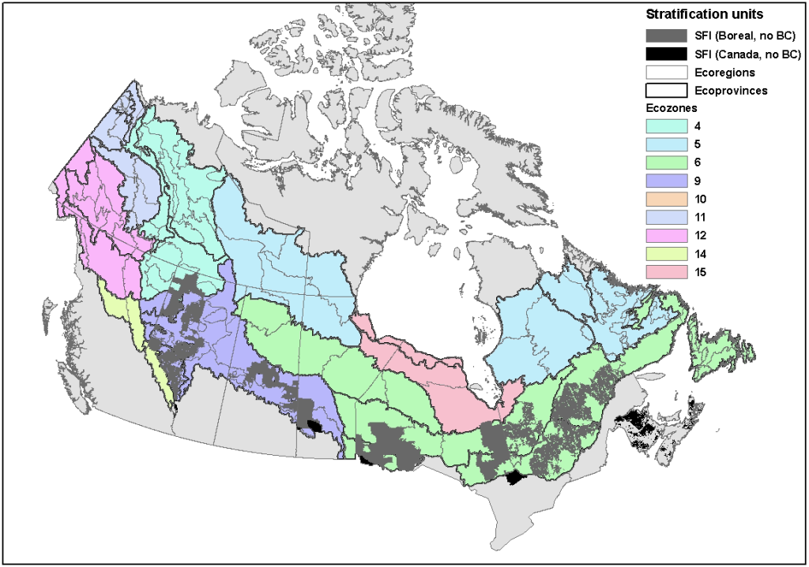

# Stratification units

The broad study area consists of SFI tenures and the boreal region within which they are embedded. We evaluated the representation of SFI tenures at multiple spatial scales, so we stratified the study area using the ecological regions of Canada (Ecological Stratification Working Group 1996), a hierarchical system widely used in Canada1. We considered four nested levels:

* Boreal (1 unit consisting of extent of ecozones that are mostly within the boreal region)
* Ecozones (9 units, 6 of which include SFI tenures)
* Ecoprovinces (29 units, 12 of which include SFI tenures)
* Ecoregions (94 units, 25 of which include SFI tenures)

 
The boreal region of Canada was stratified into three hierarchical levels using the National Ecological Framework for Canada (Ecological Stratification Working Group 1996). Ecoregions (grey outlines) are nested within ecoprovinces (black outlines) which are nested within ecozones (colours). SFI tenures are shaded grey (within study area) and black (outside study area).

## References

Ecological Stratification Working Group. 1996. A National Ecological Framework for Canada. Ottawa/Hull, ON, Canada: Agriculture and Agri-Food Canada, Research Branch, Centre for Land and Biological Resources Research and Environment Canada, State of Environment Directorate.
