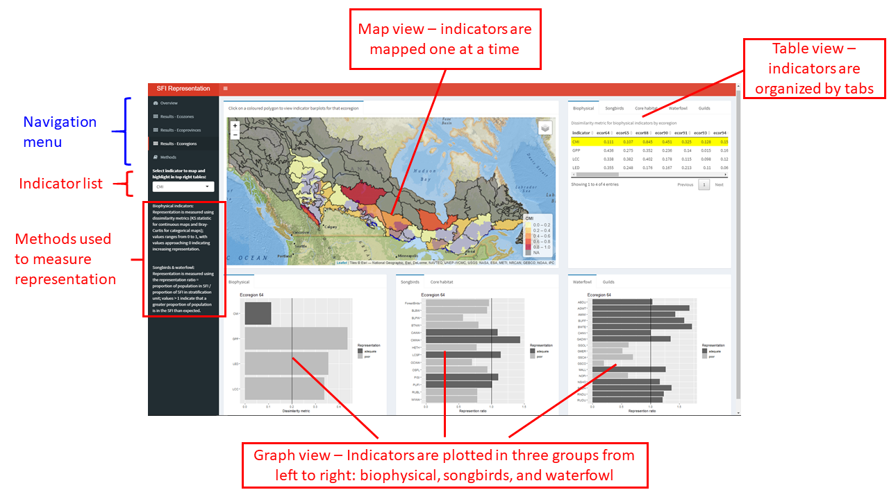
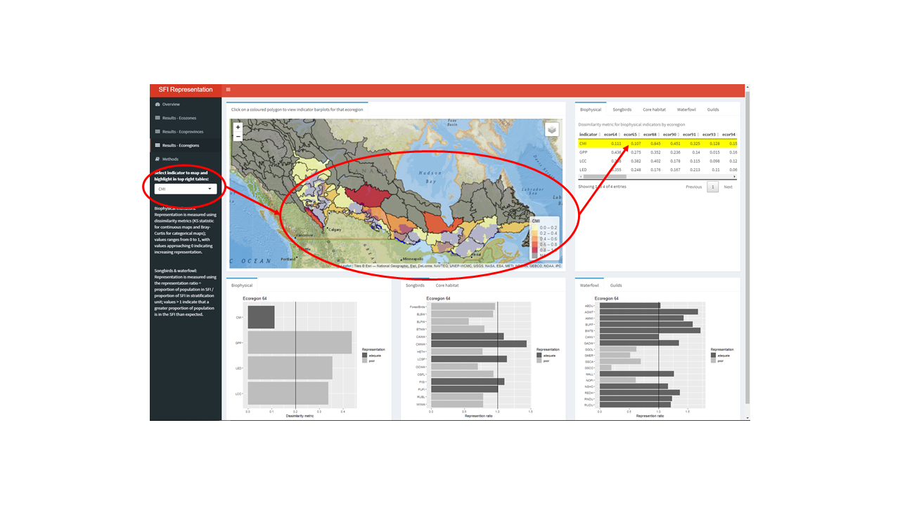
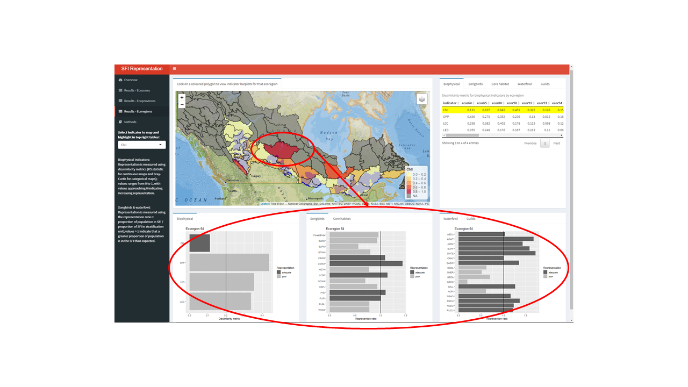

# Welcome to the BAM and BEACONs SFI Representation Assessment Tool

The Conservation Value Assessment Tool is an online application that enables users to explore and evaluate the representation of bird-related conservation values within SFI-certified forestlands at multiple spatial scales ranging from ecoregions to the entire Canadian boreal region (see Stratification units tab above). The current focus is on the evaluation of a suite of species and biophysical indicators that were selected by BAM and BEACONs to function in this demonstration. The full list of indicators can be viewed by clicking on the Ecological datasets tab above. We measured conservation valueby evaluating the ecological representation of the indicators i.e., how well do SFI lands represent each indicator? The approach and the specific measures used are described in detail in the Methods  section on the left. The following screen captures describe the main components of the tool and how to interpret results.

## Overview

Overview of the main components of the three results sections (Ecozones, Ecoprovinces, and Ecoregions):

There are two options for interacting with the results at each spatial scale.

### Option 1 - Select an indicator

Select a biophysical indicator from the dropdown list on the left e.g., CMI. That indicator will then be mapped and it's values highlighted in yellow in the table on the top right hand side.

### Option 2 - Select a polygon

Select a polygon (ecozone, ecoprovince, or ecoregion). Results for all indicators in that polygon will be displayed in the three bar charts at the bottom.

